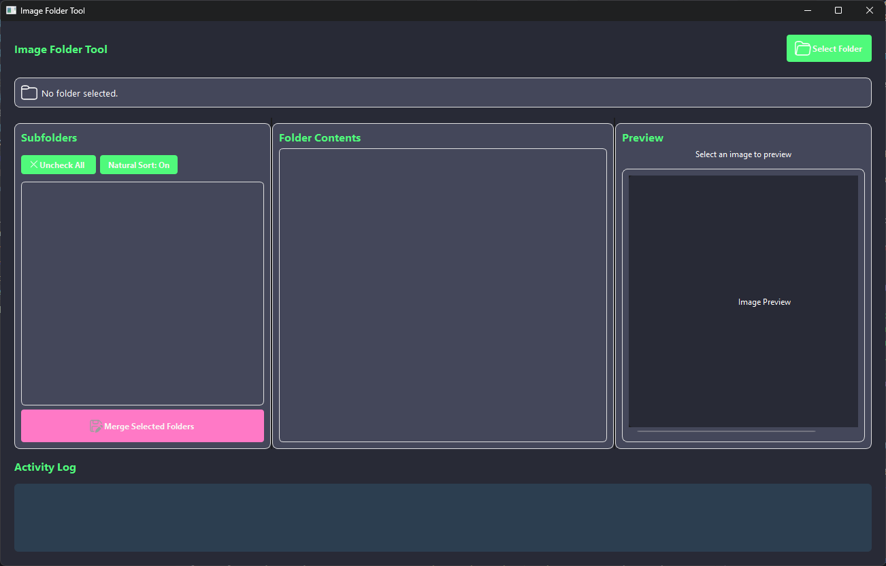

# Merge Picture folders

A modern GUI tool to manage and merge image subfolders, built with PySide6.



## Features

- Interactive folder browser with drag and drop support
- Image preview functionality with thumbnails
- Background processing for folder operations
- Modern, stylish user interface with customizable themes
- Activity logging for operation tracking
- Support for multiple image formats (PNG, JPG, JPEG, BMP, GIF, TIFF, WEBP, HEIC)

## Requirements

- Python 3
- PySide6 (Qt for Python)

## Installation

1. Clone the repository:
   ```
   git clone https://github.com/Alchemist-Aloha/merge_picfolders.git
   cd merge_picfolders
   ```

2. Install dependencies:
   ```
   pip install -r requirements.txt
   ```

## Usage

Run the application:
```bash
python src/main.py
```


## Project Structure

- `src/main.py` - Application entry point
- `src/window.py` - Main GUI implementation
- `src/worker.py` - Background task processing

## License

MIT