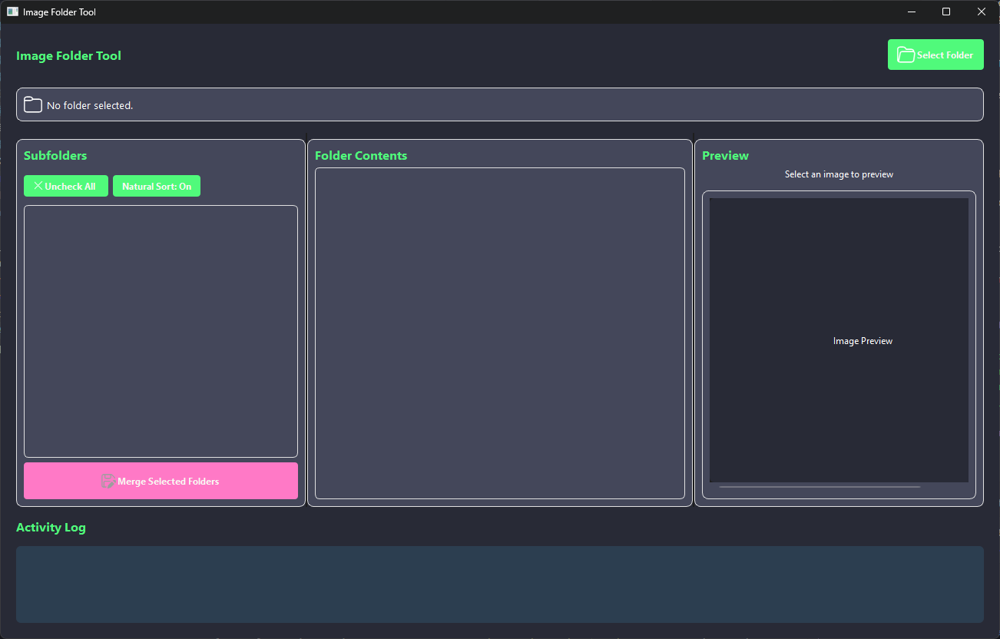

# Merge Picture folders

A modern GUI tool to manage and merge image folders, built with PySide6.



## Features

- Interactive folder browser with drag and drop support
- Image preview functionality with thumbnails
- Background processing for folder operations
- Modern, stylish user interface with customizable themes
- Activity logging for operation tracking
- Support for multiple image formats (PNG, JPG, JPEG, BMP, GIF, TIFF, WEBP, HEIC)

## Requirements

- Python 3.8+
- [uv](https://github.com/astral-sh/uv) (recommended) or PySide6

## Installation & Usage

### Using uv (Recommended)

1. Clone the repository:
   ```bash
   git clone https://github.com/Alchemist-Aloha/MergePicFolders.git
   cd MergePicFolders
   ```

2. Run the application directly:
   ```bash
   uv run mergepicfolders
   ```

   Or run with the module path:
   ```bash
   uv run python -m MergePicFolders
   ```

### Using pip

1. Clone the repository:
   ```bash
   git clone https://github.com/Alchemist-Aloha/MergePicFolders.git
   cd MergePicFolders
   ```

2. Install the package in editable mode:
   ```bash
   pip install -e .
   ```

3. Run the application:
   ```bash
   python -m MergePicFolders
   ```


## Project Structure

- `MergePicFolders/__main__.py` - Application entry point
- `MergePicFolders/window.py` - Main GUI implementation
- `MergePicFolders/worker.py` - Background task processing

## License

MIT